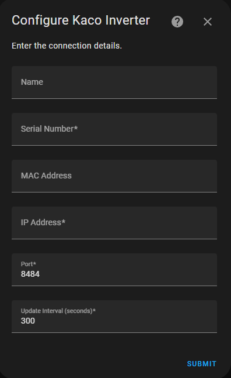
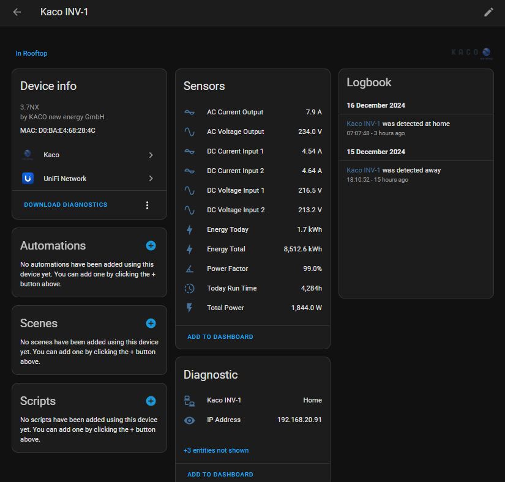

## This is the first custom component I make for Home Assistant. So I appreciate any feedback, assistance, or imrpovements.

<p align="center">
  
</p>

# Kaco Inverter Integration for Home Assistant


[](https://openai.com/chatgpt)


A custom integration for [Home Assistant](https://www.home-assistant.io/) to read and monitor data from Kaco 3.7NX inverters. This integration allows you to seamlessly integrate your Kaco inverter into your smart home setup, providing real-time insights and control.

This integration was inspired by [Kolja Windeler's Kaco integeration](https://github.com/KoljaWindeler/kaco).


## Supported models: 
My inverters models are 3.7NX but I think this will work with other models, at least partially, i.e. 'NH3'

## Table of Contents

- [Kaco Inverter Integration for Home Assistant](#kaco-inverter-integration-for-home-assistant)
  - [Supported models:](#supported-models)
  - [Table of Contents](#table-of-contents)
  - [Features:](#features)
  - [Requirements](#requirements)
  - [Installation](#installation)
    - [Manual Installation](#manual-installation)
    - [Update method:](#update-method)
  - [Configuration](#configuration)
    - [Setup Steps](#setup-steps)
      - [Steps to Add the Integration](#steps-to-add-the-integration)
  - [Usage](#usage)
  - [Screenshots](#screenshots)
    - [Main Logo](#main-logo)
    - [Setup Form](#setup-form)
    - [Device Page](#device-page)
  - [External Links](#external-links)
  - [Troubleshooting](#troubleshooting)
  - [Contributing](#contributing)
  - [Enhancements on 20 AUG 2025](#enhancements-on-20-aug-2025)
    - [Benefits:](#benefits)
  - [Enhancements on 18 AUG 2025](#enhancements-on-18-aug-2025)

## Features:

- **Local network**: Doesn't require internet connection, all readings are made in the local network.
- **Combined Device**: Uses the MAC address (if provided) for the device id, which enable Home Assistant to combine the device with other devices provided by other integrations using MAC address i.e. Router, in my case UDMPRO gateway.
- **Real-Time Monitoring**: Track the performance and status of your Kaco 3.7NX inverter.
- **Multiple Inverters Support**: Easily integrate and monitor multiple inverters.
- **Network Integration**: Combine with other networked devices like Unifi Network for enhanced functionality.
- **User-Friendly Setup**: Simple installation and configuration process.

## Requirements

- **Home Assistant Core**: Version 2023.9 or higher.
- **Kaco Inverter**: Connected to the same network as Home Assistant.

## Installation


### Manual Installation

1. **Download the Repository**:
   - Clone or download the repository from [GitHub](https://github.com/RASBR/home-assistant-kaco).
2. **Copy to Custom Components**:
   - Place the `kaco` folder into the `custom_components` directory of your Home Assistant configuration.
3. **Restart Home Assistant**:
   - Restart Home Assistant to recognize the new integration.
4. **Add the integration**:
   - Add the integration and follow the setup wizard.

### Update method:

1. Delete all the content of the kaco folder inside the custom_components folder (make sure to delete the '__pycache__' folder too).
2. Copy the content of the custom_components/kaco/ folder in place of the deleted files.
3. Restart Home Assistant
4. Reload the integration for existing devices.

## Configuration

### Setup Steps

**Important:**

- **Inverter Availability**: Ensure at least one Kaco inverter is functioning and connected to the network, preferably during daylight hours.
- **MAC Address Requirement**: To have the inverter's page in Home Assistant show the inverter's data and sensors from other integrations in addition to this in the same device page (e.g., Unifi Network), you must enter the inverter's MAC address during setup.

#### Steps to Add the Integration

1. **Access Integrations**:
   - Go to **Settings** > **Devices & Services** in Home Assistant.
2. **Add Integration**:
   - Click on **Add Integration**.
   - Search for "Kaco 3.7NX" and select it.
3. **Configure the Inverter**:

   - Follow the on-screen prompts to enter necessary details, including the MAC address if combining with other integrations.
   - Refer to the setup form for guidance:

     

4. **Finalize Setup**:

   - Once configured, the inverter device will appear in your devices list:

     

## Usage

After successful installation and configuration, the integration will create various sensors and entities that reflect the inverter's performance metrics. You can:

- **Add to Dashboards**: Display inverter data on your Home Assistant dashboards.
- **Create Automations**: Use inverter data to trigger automations, such as adjusting energy consumption based on solar production.
- **Monitor Performance**: Keep track of energy generation, consumption, and other vital statistics in real-time.

## Screenshots

### Main Logo

<p align="center">
  
</p>

### Setup Form


### Device Page


## External Links

- **Kaco Inverters Page**: [BluePlanet 30 NX1-M2 50 NX1-M2](https://kaco-newenergy.com/de/produkte/blueplanet-30-nx1-m2-50-nx1-m2)
- **Inverter Image**: [View Image](https://kaco-newenergy.com/index.php?eID=dumpFile&t=p&p=177&token=4c56dcee65385efcf268dbd8692c998ddcf42803)

## Troubleshooting

- **Inverter Not Detected**:
  - Ensure the inverter is powered on and connected to the network.
  - Verify that the MAC address entered is correct.
- **Integration Fails to Install via HACS**:
  - Check your HACS configuration and ensure it's up to date.
  - Restart Home Assistant and try installing again.
- **No Data Displayed**:
  - Confirm that the inverter is operational and generating data.
  - Check Home Assistant logs for any error messages related to the integration.

## Contributing

Contributions are welcome! Whether it's reporting issues, suggesting features, or submitting pull requests, your input helps improve the integration.

1. **Fork the Repository**: Click the **Fork** button at the top right of this repository.
2. **Create a Feature Branch**:
   ```bash
   git checkout -b feature/YourFeature
   ```

## Enhancements on 20 AUG 2025
* Added a connection status sensor to the SENSORS list that will show "Online" or "Offline"

* Added persistence storage by adding self._last_known_state = None in the constructor

* Modified the available property to:
  * Always return True for the connection status sensor (so it can show offline status)
  * Always return True for all other sensors (so they stay available with last known values)

* Enhanced the state property to:
  * Handle the connection status sensor specially (returns "Online"/"Offline")
  Store successful readings as _last_known_state
  * Return the last known state when current data is unavailable

### Benefits:
* Simple implementation: Minimal code changes with clear logic
Clear status indication: The "Connection Status" sensor will show "Online" or "Offline"
* Data persistence: All other sensors will keep their last known values when the inverter goes offline
* No breaking changes: Existing functionality is preserved, just enhanced
Diagnostic category: The connection status sensor is placed in the diagnostic category alongside other status information
* Users will now be able to see both the connection status and maintain access to their energy data for dashboards and automations even when the inverter is offline (typically at night).


## Enhancements on 18 AUG 2025
- Added state_class to entities.
- Added some stat entities.
- Add reconfigure option for existing devices
- Added model field to be entered manually and shows on the device page.

